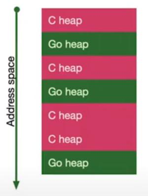

# CGO

---


## Что будет рассказанно

- Введение в CGO
- Управление памятью
- Инстурменты
- Скорость выполнения
- Время компилции
- Кросс-компиляция

---


## Начать использовать CGO просто

```go
import "C"

func main() {}
```

---


### GCC флаги

- **CFLAGS** - флаги для сборки C кода
- **CPPFLAGS** - флаги для сборки C++ кода
- **CXXFLAGS** - флаги для сборки C++ кода
- **FFLAGS** - флаги для сборки Fortran кода
- **LDFLAGS** - флаги для линковщика

```go
/*
#cgo CFLAGS: -DPNG_DEBUG=1
#cgo amd64 386 CFLAGS: -DX86=1
#cgo LDFLAGS: -lpng
#include <png.h>
*/
import "C"

func main() {}
```

---


### Pkg-config

```go
/*
#cgo pkg-config: libpng
#include <png.h>
*/
import "C"

func main() {}
```

---


### CGO флаги через ENV переменные

- **CGO_CFLAGS** - для сборки C кода
- **CGO_CPPFLAGS** - для сборки C++ кода
- **CGO_CXXFLAGS** - для сборки C++ кода
- **CGO_FFLAGS** - для сборки Fortran кода
- **CGO_LDFLAGS** - для линковщика

---


### ENV переменные разрешённых CGO флагов

- **CGO_CFLAGS_ALLOW** - для сборки C кода
- **CGO_CPPFLAGS_ALLOW** - для сборки C++ кода
- **CGO_CXXFLAGS_ALLOW** - для сборки C++ кода
- **CGO_FFLAGS_ALLOW** - для сборки Fortran кода
- **CGO_LDFLAGS_ALLOW** - для линковщика

---


### ENV переменные запрещённых CGO флагов

- **CGO_CFLAGS_DISALLOW** - для сборки C кода
- **CGO_CPPFLAGS_DISALLOW** - для сборки C++ кода
- **CGO_CXXFLAGS_DISALLOW** - для сборки C++ кода
- **CGO_FFLAGS_DISALLOW** - для сборки Fortran кода
- **CGO_LDFLAGS_DISALLOW** - для линковщика

---


### Список разрешённых по умолчанию флагов

```text
https://github.com/golang/go/blob/go1.16.2/src/cmd/go/internal/work/security_test.go#L12
```

---


### С типы в Go

| Обозначение в Go | Обозначение в C    |
| ---------------- | ------------------ |
| unsafe.Pointer   | void*              |
| C.char           | char               |
| C.schar          | signed char        |
| C.uchar          | unsigned char      |
| C.short          | short              |
| C.ushort         | unsigned short     |
| C.int            | int                |
| C.uint           | unsigned int       |
| C.long           | long               |
| C.ulong          | unsigned long      |
| C.longlong       | long long          |
| C.ulonglong      | unsigned long long |
| C.float          | float              |
| C.double         | double             |
| C.complexfloat   | complex float      |
| C.complexdouble  | complex double     |

---


### Доступ к структурам, enum

Для доступа к C struct, union, or enum в Go нужно добавлять префиксы struct_, union_, или enum_.

```go
/*
struct S { int a; };
*/
import "C"
import "fmt"

func main() {
	s := C.struct_S{a: 10}
	fmt.Println(s)
}
```

---


### Определение размера структуры и типов данных

```go
/*
struct S { int a; };
*/
import "C"
import "fmt"

func main() {
	fmt.Println(C.sizeof_struct_S)
	fmt.Println(C.sizeof_int)
}
```

---


### Вызов функции через указатель

```go
/*
typedef int (*intFunc) ();

int call_int_func(intFunc f) {
	return f();
}

int fortytwo() {
	return 42; 
}
*/
import "C"
import "fmt"

func main() {
	f := C.intFunc(C.fortytwo)
	fmt.Println(int(C.call_int_func(f)))
}
```

---


### Специальные функции для копирования данных из Go в C

Конвертирует Go строку в C строку.
Строка C должна быть потом освобождена чере вызов C.free
```go
func C.CString(string) *C.char
```

Конвертирует Go слайс байтов в C массив байтов.
C массив байтов должен быть потом освобождён чере вызов C.free
```go
func C.CBytes([]byte) unsafe.Pointer
```

---


### Специальные функции для копирования данных из C в Go

C строка в Go строку
```go
func C.GoString(*C.char) string
```

C строка в Go строку с ограничением по размеру строки
```go
func C.GoStringN(*C.char, C.int) string
```

C массив байтов с заданым размером в Go слайс байтов
```go
func C.GoBytes(unsafe.Pointer, C.int) []byte
```

---


### Конвертация памяти напрямую из C в Go

Конвертация памяти напрямую без копирования в Go слайс байтов
```go
slice := (*[1 << 30]byte)(unsafe.Pointer(&C.buf))[:int(C.buf_size):int(C.buf_size)]
```

Конвертация памяти напрямую без копирования в Go массив байтов
```go
array := *(*[C.buf_size]byte)(unsafe.Pointer(&C.buf))
```

---


### Экспорт функций для вызова из Go

```go
//export MyFunction
func MyFunction(arg1, arg2 C.int, arg3 *C.char) C.int {...}

//export MyFunction2
func MyFunction2(arg1, arg2 C.int, arg3 *C.char) (C.int, *C.char) {...}
```

---


## Заголовочный файл, генерируемый CGO

```c
typedef struct { const char *p; ptrdiff_t n; } _GoString_;
typedef signed char GoInt8;
typedef unsigned char GoUint8;
typedef short GoInt16;
typedef unsigned short GoUint16;
typedef int GoInt32;
typedef unsigned int GoUint32;
typedef long long GoInt64;
typedef unsigned long long GoUint64;
typedef GoInt64 GoInt;
typedef GoUint64 GoUint;
typedef __SIZE_TYPE__ GoUintptr;
typedef float GoFloat32;
typedef double GoFloat64;
typedef float _Complex GoComplex64;
typedef double _Complex GoComplex128;
typedef _GoString_ GoString;
typedef void *GoMap;
typedef void *GoChan;
typedef struct { void *t; void *v; } GoInterface;
typedef struct { void *data; GoInt len; GoInt cap; } GoSlice;

extern int MyFunction(GoInt arg1, GoInt arg2, char* arg3);

struct MyFunction2_return {
	int r0;
	char* r1;
};
extern struct MyFunction2_return MyFunction2(int arg1, int arg2, char* arg3);
```

---


## Плюсы GO

- Управление памятью
- Инстурменты
- Скорость выполнения
- Время компилции
- Кросс-компиляция

---


## Они же и минусы в CGO

- Управление памятью
- Инстурменты
- Скорость выполнения
- Время компилции
- Кросс-компиляция

---


## Перейдём к примерам

---


## Фрагментация памяти

В Go приложениях с CGO 2-е независимые кучи:

- Go
- C

Когда освобождается память в приложении, то аллокатор старается вызвать unmap и отдать память в ОС.

Когда в приложении несколько куч - есть проблема с возвращением неиспользуемой памяти в систему.



---


## Профилировщик CGO от reindexer

```go
import _ "https://github.com/restream/reindexer/pprof"

// ...

go func() {
	log.Println(http.ListenAndServer("localhost:6060", nil))
}()
```

### Google Performance Tools

```text
https://github.com/gperftools/gperftools
```

The fastest malloc we’ve seen; works particularly well with threads and STL. Also: thread-friendly heap-checker, heap-profiler, and cpu-profiler.

---


## CGO гораздо ближе чем мы думаем

- os/user
- net
- crypto/x509
- plugin

---


## Спасибо за внимание! Задавайте ваши вопросы.

Презентация и примеры находятся Github

```text
https://github.com/serenissimus/cgo-presentation
```
